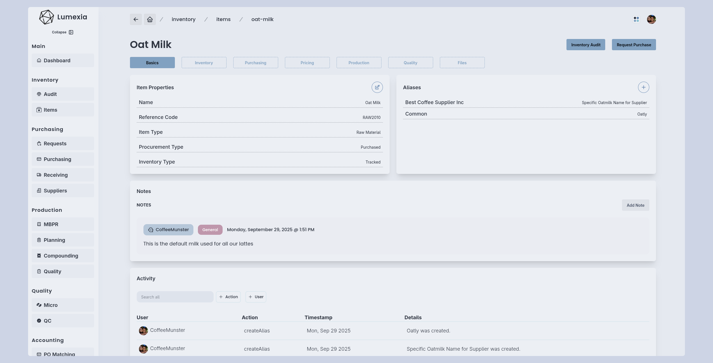

# Lumexia - Manufacturing ERP

Lumexia is a manufacturing and inventory management system that aims to make procurement, purchasing, pricing, production, quality and resource planning easier and more traceable.

## Work In Progress

Lumexia has also been my medium for learning different technologies and orchestrating them into a specific vision. The app is under active development and is an ongoing work in progress.

Made with: 
- Next.js
- TypeScript
- PostgreSQL
- Prisma
- Minio
- Docker

## Roadmap

The following are features that are currently implemented:
- inventory
  - QR code labels
  - audits and label scanning
  - trends
  - on hand, allocated, available quantities
- purchasing
  - procurement requests
  - purchase orders
  - supplier management and tracking
- receiving
  - partial PO receiving
  - partial line item receiving
- master batch records 
  - versioning
  - multiple batch sizes
  - production instructions
- batch production records
  - item lot tracing and inventory allocation
  - production staff staging and compounding with qc and image verification
  - primary and secondary quality checks for compounding and staging 
  - step-wise instructions and quality alerts
  - planning and schedule visibility
- quality
  - parameters with custom input definitions
  - parameter template and groups
  - item specifications and test parameters
  - quality examinations
- pricing
  - price items based on procurement type (purchased vs produced)
  - include auxiliary items in pricing, such as packaging
  - full bill of material (BOM) pricing for produced items
  - calculation of price and margin based on consumer price and BOM cost
  - pricing verification system

The following are implemented but very specific and not yet generalized:
- microbiological
- accounting-purchase order matching

Things you can expect from future development:
- demo
- overhaul of receiving
- overhaul and generalization of accounting
- overhaul of supplier dashboard
- customizable home page dashboard
- production scale/balances IOT integrating with staging, compounding and quality
- inventory locations 
- examples and screenshots
